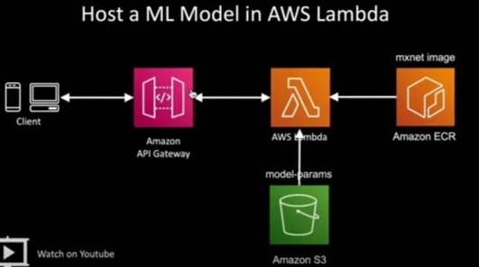
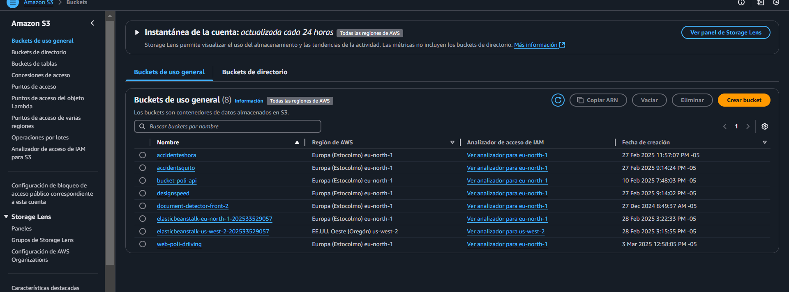

# Despliegue de Modelo en ECR, S3, Lambda y API Gateway



## Índice

1. [Pasos Previos](#pasos-previos)
2. [Subir el Modelo a S3](#1-subir-el-modelo-a-s3)
3. [Subir la Imagen a Amazon ECR](#2-subir-la-imagen-a-amazon-ecr)
4. [Crear la Función Lambda](#3-crear-la-función-lambda)
5. [Crear la API en API Gateway](#4-crear-la-api-en-api-gateway)
6. [Probar la API](#5-probar-la-api)
7. [Actualizar la Función Lambda](#6-actualizar-la-función-lambda)

---

## 1.Pasos Previos

1. **Requisitos iniciales**:
    - Tener un bucket en S3 con el modelo `.joblib` disponible.
    - Crear un repositorio en ECR (ejemplo: `mlp-predictor-repo`).
    - Instalar AWS CLI en Ubuntu.

    Si no tienes AWS CLI instalado, ejecuta los siguientes comandos:

    #### En Linux:
    ```bash
    curl "https://awscli.amazonaws.com/awscli-exe-linux-x86_64.zip" -o "awscliv2.zip"
    unzip awscliv2.zip
    sudo ./aws/install
    aws --version
    ```

    #### En Windows:
    1. Descarga el instalador desde el siguiente enlace: [AWS CLI para Windows](https://awscli.amazonaws.com/AWSCLIV2.msi).
    2. Ejecuta el archivo `.msi` y sigue las instrucciones del asistente de instalación.
    3. Verifica la instalación abriendo una terminal de PowerShell y ejecutando:
        ```powershell
        aws --version
        ```

2. **Configurar la terminal**:
    - Crea un usuario en IAM y genera las credenciales de acceso (`access_key`).
    - Configura AWS CLI con el siguiente comando:

      ```bash
      aws configure
      ```

      Introduce los valores solicitados:
      - `AWS Access Key ID`: YOUR_ACCESS_KEY_ID
      - `AWS Secret Access Key`: YOUR_SECRET_ACCESS_KEY
      - `Default region name`: REGION
      - `Default output format`: json

    - Verifica la configuración con:

      ```bash
      aws sts get-caller-identity
      ```

      Ejemplo de salida:

      ```json
      {
            "UserId": "USER_ID",
            "Account": "ACCOUNT_ID",
            "Arn": "arn:aws:iam::ACCOUNT_ID:user/YOUR_IAM_NAME"
      }
      ```

    - Configura ECR para Docker:

      ```bash
      aws ecr get-login-password --region REGION | docker login --username AWS --password-stdin ACCOUNT_ID.dkr.ecr.REGION.amazonaws.com
      ```

3. **Creación de usuarios y roles**:
    - **Usuario**:
      - Nombre: `YOUR_IAM_NAME` (ejemplo: `jperez`).
      - Políticas de permisos:
         - `AmazonEC2ContainerRegistryFullAccess`
         - `AWSLambda_FullAccess`
         - `AmazonAPIGatewayAdministrator`
         - `AmazonS3FullAccess`

    - **Rol**:
      - Nombre: `YOUR_ROLE_NAME` (ejemplo: `mi-rol-lambda`).
      - Caso de uso: selecciona **AWS service** y elige **Lambda**.
      - Políticas de permisos:
         - `AWSLambdaBasicExecutionRole`
         - `AWSLambda_FullAccess`
         - `AmazonS3ReadOnlyAccess`
         - Política personalizada (opcional):

            ```json
            {
                 "Version": "2012-10-17",
                 "Statement": [
                      {
                            "Sid": "VisualEditor0",
                            "Effect": "Allow",
                            "Action": [
                                 "ec2:CreateNetworkInterface",
                                 "ec2:DescribeNetworkInterfaces",
                                 "ec2:DescribeVpcs",
                                 "ec2:DeleteNetworkInterface",
                                 "ec2:DescribeSubnets",
                                 "ec2:DescribeSecurityGroups"
                            ],
                            "Resource": "*"
                      }
                 ]
            }
            ```

---

## **1. Subir el Modelo a S3**

1. En el servicio S3, selecciona la opción **Buckets** en el panel izquierdo.
2. Haz clic en **Crear bucket**.

    

    - Configura el bucket con un nombre único (este nombre será usado en el script de Lambda).
    - Deja las configuraciones por defecto.

3. Sube el archivo del modelo (`model.joblib`).

    

4. Edita el archivo `inference.py` para actualizar el nombre del bucket.

    

---

## **2. Subir la Imagen a Amazon ECR**

1. En el servicio ECR, selecciona **Repositorios** en el panel izquierdo y haz clic en **Crear repositorio**.

    

2. Asigna un nombre al repositorio y selecciona la opción **Mutable**.

    

3. Toma nota de la URL del repositorio, ya que será necesaria para los siguientes pasos.

    

### Preparar el repositorio

- Asegúrate de tener configurada la consola de AWS y estar en el directorio que contiene los archivos `Dockerfile` y `inference.py`.

### Construir la Imagen Docker

1. Verifica que los archivos `Dockerfile` y `inference.py` estén en la misma carpeta.
2. Ejecuta el siguiente comando:

    ```bash
    docker build -t mlp-model .
    ```

### Etiquetar y Subir la Imagen a ECR

1. Etiqueta la imagen con la URI del repositorio de ECR:

    ```bash
    docker tag mlp-model:latest ACCOUNT_ID.dkr.ecr.REGION.amazonaws.com/NOMBRE_REPOSITORIO_ECR:latest
    ```

2. Sube la imagen al repositorio de ECR:

    ```bash
    docker push ACCOUNT_ID.dkr.ecr.REGION.amazonaws.com/NOMBRE_REPOSITORIO_ECR:latest
    ```

---

## **3. Crear la Función Lambda**

1. En el servicio Lambda, selecciona **Funciones** en el panel izquierdo y haz clic en **Crear función**.

    

2. Selecciona la opción **Imagen de contenedor**, asigna un nombre a la función y haz clic en **Examinar imágenes**.

    

3. Selecciona la imagen del repositorio creado previamente.

    

4. Configura la arquitectura como `x86_64` (por defecto) y asigna el rol creado con los permisos necesarios.

    

5. En la pestaña **Probar**, crea un evento JSON de prueba y haz clic en **Probar**.

    ```json
    {
         "body": "{\"Input\": [[0.5, 2.3, 1.2, 3.4, 0.9, 98, 12.4, 72, 120, -34.6, -58.4, 2, 0]]}",
         "headers": {
              "Content-Type": "application/json"
         },
         "httpMethod": "POST",
         "isBase64Encoded": false,
         "path": "/predict",
         "queryStringParameters": {},
         "requestContext": {
              "httpMethod": "POST",
              "requestId": "test-request-id"
         }
    }
    ```

    

6. Si obtienes un error, ajusta el tiempo de espera en la pestaña **Configuración**.

    

    - Incrementa el tiempo de espera a 20 segundos y guarda los cambios.

    

7. Vuelve a realizar la prueba. Una vez que funcione correctamente, reduce el tiempo de espera a 3 segundos.

    

---

## **4. Crear la API en API Gateway**

1. En el servicio API Gateway, selecciona **Crear API**.

    

2. Configura los parámetros:
    - Tipo de API: **Nueva API**.
    - Nombre de la API.
    - Tipo de punto de conexión: **Regional**.

    

3. En el menú **Recurso**, selecciona **Crear recurso**.

    

4. Crea un método POST y configura los detalles:
    - Tipo de integración: **Función Lambda**.
    - Región y ARN de la función Lambda.

    

5. Implementa la API para obtener la URL de invocación.

    .png)

    Ejemplo de URL:

    ```plaintext
    https://{nombre-api}.execute-api.{region}.amazonaws.com/{stage-name}/{resource-path}
    ```

---

## **5. Probar la API**

1. Usa **Postman** para probar la API.
2. Configura el método como POST y pega la URL generada.

    

3. En el cuerpo de la solicitud, selecciona **raw** y pega el siguiente input:

    ```json
    {"Input": [[0.5, 2.3, 1.2, 3.4, 0.9, 98, 12.4, 72, 120, -34.6, -58.4, 2, 0]]}
    ```

    

4. Asegúrate de que el encabezado tenga `Content-Type: application/json`.

    

---

## **6. Actualizar la Función Lambda**

1. Realiza los cambios necesarios en el archivo `inference.py` y guarda los cambios.
2. Reconstruye la imagen Docker:

    ```bash
    docker build -t mlp-model .
    ```

3. Etiqueta y sube la nueva imagen a ECR:

    ```bash
    docker tag mlp-model:latest ACCOUNT_ID.dkr.ecr.REGION.amazonaws.com/NOMBRE_REPOSITORIO_ECR:latest
    docker push ACCOUNT_ID.dkr.ecr.REGION.amazonaws.com/NOMBRE_REPOSITORIO_ECR:latest
    ```

4. Actualiza la función Lambda con la nueva imagen:

    - Ve a la pestaña **Imagen** de la función Lambda.
    - Selecciona **Implementar nueva imagen**.

      

    - Guarda los cambios.

      

    La función se actualizará correctamente.

    
