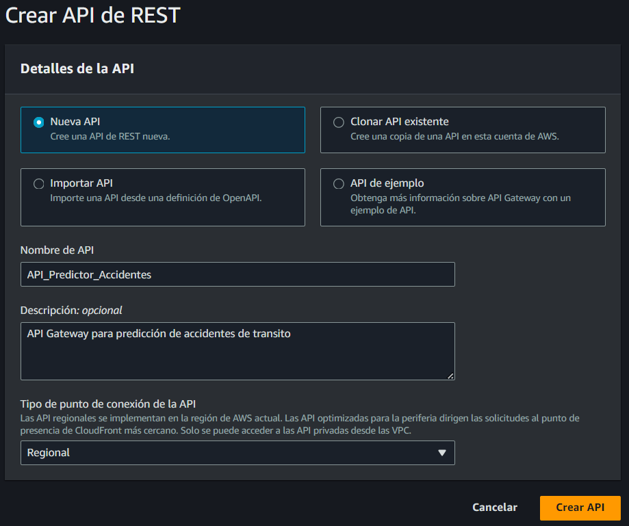
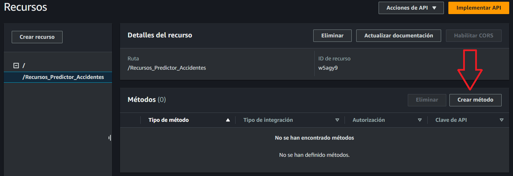

# Despliegue de Base de Datos en RDS y Consumo con Lambda y API Gateway

## Índice

1. [Creación de la Base de Datos en Amazon RDS](#creación-de-la-base-de-datos-en-amazon-rds)
2. [Conexión de pgAdmin a la Instancia de RDS](#conexión-de-pgadmin-a-la-instancia-de-rds)
3. [Subir Tablas y Funciones a la Base de Datos en RDS](#subir-tablas-y-funciones-a-la-base-de-datos-en-rds)
4. [Subir la Base de Datos a Amazon RDS mediante pgAdmin](#subir-la-base-de-datos-a-amazon-rds-mediante-pgadmin)
5. [Modelo Relacional en PlantUML](#modelo-relacional-en-plantuml)
6. [Ejecución del Script para Crear Tablas y Funciones](#ejecución-del-script-para-crear-tablas-y-funciones)
7. [Script en Python para Cargar los CSV en las Tablas](#script-en-python-para-cargar-los-csv-en-las-tablas)
8. [Verificación de Datos Insertados](#verificación-de-datos-insertados)
9. [Configuración de la Función Lambda](#configuración-de-la-función-lambda)
10. [Creación de la API en API Gateway](#creación-de-la-api-en-api-gateway)

---

## Creación de la Base de Datos en Amazon RDS


1. Dirígete a la consola de Amazon RDS y haz clic en **"Base de datos"** en el panel izquierdo.  
    

2. Haz clic en el botón **"Crear base de datos"**.  
    

3. Selecciona la opción de **"Creación estándar"** y elige el motor **PostgreSQL**.  
    

4. Asigna un nombre como identificador para la base de datos (RDS). Nota: Este no es el nombre de la base de datos que se configurará más adelante.  
    

5. Selecciona la opción **Autoadministrado** y crea una contraseña "Pis2220*polidriving" para el acceso.  
    

6. En la configuración de la instancia, selecciona el tipo **db.t4g.micro**.  
    

   Almacenamiento:
   

8. Configura la opción para que **no se conecte a un recurso EC2**.  
    

9. Configura la VPC y marca la opción para hacerla pública. Esto permitirá conectarte para crear tablas y cargar datos.  
    
    
   
    **Nota:** Dentro del grupo de seguridad de la VPC, crea una regla de entrada con el tipo **PostgreSQL**, protocolo **TCP**, puerto **5432**, y origen **cualquier dirección IP**. Esto será necesario para conectarte localmente y posteriormente con la función Lambda.  
    

11. En el apartado de **"Configuración adicional"**, especifica el nombre de la base de datos.  
    

12. Haz clic en **"Crear base de datos"** para finalizar.

---

## Conexión de pgAdmin a la Instancia de RDS

1. Abre **pgAdmin** en tu computadora.
2. En la barra lateral de **pgAdmin**, haz clic derecho sobre **Servers** y selecciona **Create** -> **Server...**.
3. Configura el servidor:
    - En la pestaña **General**, asigna un nombre para la conexión (por ejemplo, "RDS-PostgreSQL").
    - En la pestaña **Connection**:
      - En **Host name/address**, ingresa el **endpoint** de tu base de datos RDS (disponible en la consola de RDS de AWS).
      - En **Port**, usa el puerto `5432` (por defecto para PostgreSQL).
      - En **Maintenance database**, ingresa el nombre de tu base de datos.
      - En **Username**, ingresa el usuario que creaste para la base de datos de RDS.
      - En **Password**, ingresa la contraseña configurada.
4. Haz clic en **Save** para guardar la conexión y conectar **pgAdmin** a tu base de datos en Amazon RDS.  
      
    

5. Una vez conectado, abre un script y ejecuta el código correspondiente.

---

## Subir Tablas y Funciones a la Base de Datos en RDS

1. **Esquema SQL (DDL) para crear las tablas en PostgreSQL**  
    Define las tablas utilizando tipos de datos adecuados como *VARCHAR*, *INTEGER*, *DOUBLE PRECISION* y *DATE/TIME*.

2. **Scripts en Python para cargar los CSV en las tablas**  
    Utiliza bibliotecas como *pandas* y *SQLAlchemy* para leer los archivos CSV y realizar inserciones masivas en la base de datos.

3. **Funciones SQL en PL/pgSQL**  
    Implementa funciones auxiliares como:
    - Cálculo de la distancia entre dos puntos (usando la fórmula de Haversine).
    - Contar accidentes cercanos a un punto de interés.
    - Obtener la velocidad de diseño más cercana dentro de un rango específico.  
    **Nota:** Asegúrate de que el grupo de seguridad permita conexiones desde la IP de tu máquina local.

---

## Subir la Base de Datos a Amazon RDS mediante pgAdmin

Utiliza la interfaz gráfica de **pgAdmin** para ejecutar los scripts SQL que crean las tablas y funciones en tu base de datos.

---

## Modelo Relacional en PlantUML

A continuación, se presenta el modelo relacional generado en PlantUML:  


---

## Ejecución del Script para Crear Tablas y Funciones

1. Abre la conexión a tu base de datos en **pgAdmin**.
2. Ejecuta el script `ExtraerDatosServicios/script_crear_tablas_bd.sql` disponible en el presente repositorio
---

## Script en Python para Cargar los CSV en las Tablas

1. Instala las dependencias necesarias:

     ```bash
     pip install pandas==1.3.3 sqlalchemy==1.4.23 psycopg2==2.9.1 haversine==2.5.1
     ```

2. Navega al directorio correspondiente:

     ```bash
     cd Fork_PIS_20_02_AGENTES_IA/ExtraerDatosServicios
     ```

3. Ejecuta el script `poblarPostgreSQL.py` para cargar los datos en la base de datos.

---

## Verificación de Datos Insertados

Ejecuta la siguiente consulta para verificar los datos cargados:

```sql
SELECT * FROM accidents_quito LIMIT 10;
```

---

## Configuración de la Función Lambda

1. Navega al directorio `ExtraerDatosServicios/lambdaDats` dentro del repositorio.
2. Modifica las variables de entorno en el archivo `lambda_function.py` según tu configuración.  
    

3. Empaqueta el contenido del directorio en un archivo ZIP.  
    

4. Crea una nueva función Lambda en la consola de AWS:
    - Selecciona **"Crear desde cero"**.
    - Asigna un nombre a la función.
    - Selecciona **Python 3.13** como entorno de ejecución y arquitectura **x86_64**.  
      

5. Configura el rol correspondiente para la función Lambda.  
    

6. Habilita la VPC y selecciona la subred y el grupo de seguridad que permita tráfico en el puerto **5432**.  
    

7. Carga el archivo ZIP empaquetado previamente.  
    

8. Guarda los cambios y haz clic en **Deploy**.  
    

9. Crea un evento JSON para probar la función y haz clic en **Probar**.  
      
    La salida esperada debe ser similar a la siguiente:  
    

---

## **Crear la API en API Gateway**

1. En el servicio API Gateway, selecciona **Crear API**.

    

2. Configura los parámetros:
    - Tipo de API: **Nueva API**.
    - Nombre de la API.
    - Tipo de punto de conexión: **Regional**.

    

3. En el menú **Recurso**, selecciona **Crear recurso**.

    

4. Crea un método POST y configura los detalles:
    - Tipo de integración: **Función Lambda**.
    - Región y ARN de la función Lambda.

    

5. Implementa la API para obtener la URL de invocación.

    .png)

    Ejemplo de URL:

    ```plaintext
    https://{nombre-api}.execute-api.{region}.amazonaws.com/{stage-name}/{resource-path}
    ```

---

## **4. Crear la API en API Gateway**

1. En el servicio API Gateway, selecciona **Crear API**.

    

2. Configura los parámetros:
    - Tipo de API: **Nueva API**.
    - Nombre de la API.
    - Tipo de punto de conexión: **Regional**.

    

3. En el menú **Recurso**, selecciona **Crear recurso**.

    

4. Crea un método POST y configura los detalles:
    - Tipo de integración: **Función Lambda**.
    - Región y ARN de la función Lambda.

    

5. Implementa la API para obtener la URL de invocación.

    .png)

    Ejemplo de URL:

    ```plaintext
    https://{nombre-api}.execute-api.{region}.amazonaws.com/{stage-name}/{resource-path}
    ```

---

